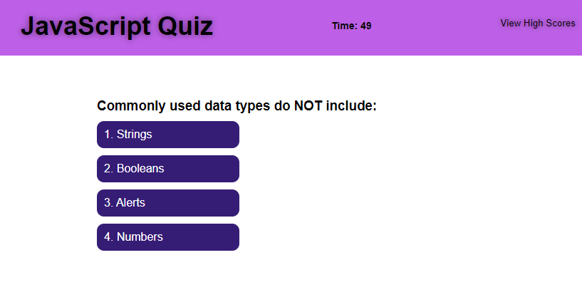

# JavaScript-Quiz (Module 4: Web API's )

This site was designed to help me understand the use of Web API's in JavaScript. During this challenge I was tasked with creating the JavaScript for a timed quiz application.

At the beginning of this project I was struggling to put some of the concepts together and ended up creating the application in a very round about way. After nearly completing the project I finally began to comprehend the concepts and ended up doing an entire rewrite of the application.

Overall, this was a huge learning experience.

## Built With
* HTML
* CSS
* JavaScript
* Web API's

## Site Location

[JavaScript Code Quiz](https://russtracy.github.io/JavaScript-Quiz/)

## Contribution
Made by [Russ Tracy]

## Site Image

